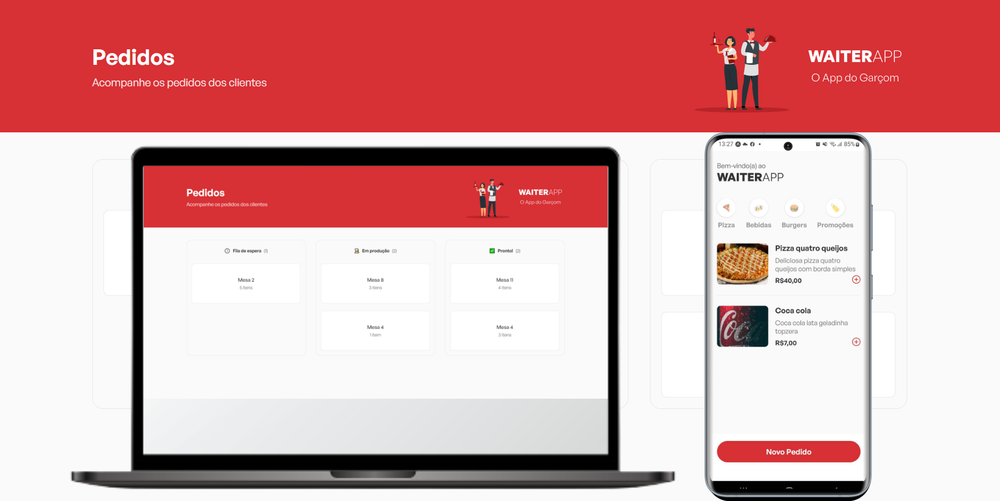

# OPJS - Front End Web

<p align="center">


<br>

<p align="center">
  <a href="#user-content-o-que-é-o-waiterapp">Sobre</a> •
 <a href="#user-content-funcionalidades">Funcionalidades</a> •
 <a href="#user-content-build-e-run">Como executar</a>
</p>





</p>

<br>

## O que é o WaiterApp?

<p align="center">

</p align="justify">

O WaiterApp foi um projeto desenvolvido durante o curso "O Poder do JavaScript", do [/maateusilva](https://github.com/maateusilva/). Esse repositório contém a aplicação web.

Feita com react e styled components, ela servirá como o front-end web cujo qual consumirá
a API feita nesse mesmo curso.

Há também um repositório para o app mobile do projeto, que se encontra aqui: [OPJS-APP](https://github.com/Vitor-Tx/opjs-app).

---

## Funcionalidades


<p align="center">


</p>

- Listagem de pedidos
- Atualização com pedidos novos(feitos no app) em tempo real com aviso na tela
- Alterar status de pedidos
- Cancelar pedidos

---


## Build e run

Se desejar executar o projeto localmente, você precisa criar um arquivo "keys.ts" na pasta raiz, cujo conteúdo é:

```typescript

export const ADDRESS = "<seu endereço IP(o que apareceu ao rodar o app mobile com o expo)>";

```

Além de, claro, estar também rodando localmente a API do projeto, a qual você pode encontrar nesse repositório: [OPJS-API](https://github.com/Vitor-Tx/opjs-api).

### Comandos para instalação

```bash

# Clone o rep
$ git clone https://github.com/Vitor-Tx/opjs-front-end.git

# Entre na pasta raiz
$ cd opjs-front-end

# Instale as depêndencias
$ npm i

# Rode o projeto(acesse http://localhost:5173/).
$ npm run dev
```

---


## Tecnologias utilizadas

- TypeScript
- React ⚛
- Styled Components 💅
- socket.io
- ESLint
- etc

[](https://github.com/Vitor-Tx/opjs-front-end/blob/master/LICENSE)


Feito por Vitor Teixeira. [Entre em contato!](https://www.linkedin.com/in/vitor-teixeira-eof/)

